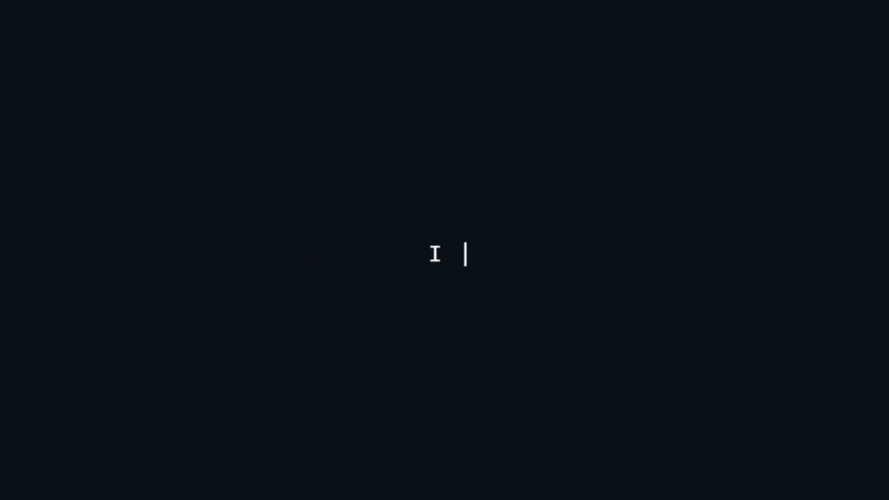

# 👋 Hi, I'm Kaan

💻 Junior Developer
🚀 I'm a tech enthusiast figuring out what path I want to take as a programmer. 

---

## 🔥 About Me

* 🎯 Interested in Computer Vision and AI systems
* 🧠 Currently working on OCR and gesture-based control systems
* ⚡ I like building performance-focused and practical applications

---

## 🚀 Projects

### 🖐️ Hand Gesture Mouse Control

Control your computer mouse using hand movements via webcam.

* Real-time hand tracking
* Gesture-based clicking
* Low latency system

### 🔍 Lightweight OCR Engine (In Progress)

A fast and efficient OCR system optimized for common fonts.

* Focused on performance
* Custom model approach
* Real-time processing goal

---

## 🛠️ Tech Stack

 

[]
[]

---

## 📫 Contact Me

* GitHub: https://github.com/Kozdemir03
* Email: [kaanozd03@gmail.com](mailto:kaanozd03@gmail.com)

---

## ⚡ Fun Fact

I enjoy turning real-world problems into working software solutions.
